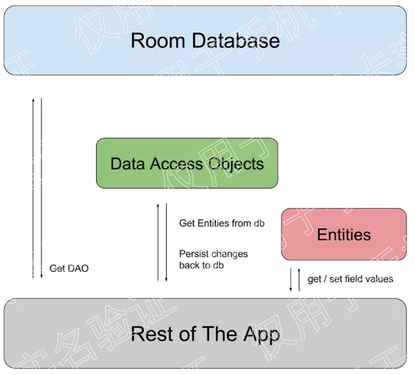

这是一个 android 提供的 sql 库的练习。

## 网页链接android数据库测试

[github 搜 Android-Debug-Database](https://github.com/amitshekhariitbhu/Android-Debug-Database)

```gradle
debugImplementation 'com.amitshekhar.android:debug-db:1.0.4'

这是一个数据库测试库，使用方法，依赖-》在控制台后打出类似下面信息来查看

D/DebugDB: Open http://192.168.88.182:8080 in your browser

可以在 buildTypes 下修改访问的端口号，添加如下代码将端口号修改为 8081

debug {
            resValue("string", "PORT_NUMBER", "8081")
        }

```

## Android SqlLite 数据库

[官方依赖网址](https://developer.android.com/topic/libraries/architecture/adding-components)

[参考网址：Room ORM 数据库框架](https://juejin.im/entry/591d41c70ce463006923f937)

添加依赖

```
implementation 'android.arch.persistence.room:runtime:1.1.1'
annotationProcessor "android.arch.persistence.room:compiler:1.1.1"
```

Room在SQLite提供一个抽象层。

Room有3个主要组成部分：

- Database: 可以使用此组件创建数据库 holder，注释定义实体列表，和类的内容定义数据访问对象（DAO）数据库中的表。它也是基本连接的主要访问点。
- Entity: 实体类对象模型，一般一对一对应表结构。实体的每个字段在数据库中都是保存的，除非你用@Ignore 注解。
- DAO: 数据库操作接口，一般一对一对应表的相关操作

这些组件，以及它们与应用程序其余部分的关系，如图所示：



### Dao

通过 @Dao 注解的一个接口，如例子中的 MyDao 

1. @Insert 插入数据，增

   - 插入数据时有解决冲突的注解，（REPLACE、ROLLBACK、ABORT、FAIL、IGNORE）


   - 插入数据可以增加单个对象，还可以增加数组对象。（其对象都是使用的 @Entity 注解的类）

2. @Update 更新数据，改

   - 和 @Insert 类似

3. @Delete 删除数据，删

   - 可以返回 int 类型，标识受影响的行数
   - 传入参数可以是一类对象，所有对象，或者某个对象。

4. @Query 查询数据，查

   - 查询数据使用 SQL 语句做查询 （"SELECT * FROM users"）

### Entity

使用 @Entity 注解的类，如例子中的 User

@Entity 可以添加的值有：

例子：

```java
@Entity(indices = {@Index(value = "user_id", unique = true)},
        foreignKeys = {@ForeignKey(entity = User.class,
                onDelete = ForeignKey.CASCADE,
                parentColumns = "id",
                childColumns = "user_id")})
```


1. tableName: 表名
2. indices：索引，数组变量(注解中的的注解)
3. foreignKeys :外键设置，数组变量

#### 字段注解

1. @PrimaryKey :私有键，每个表必须有的，可以设置是否自增（autoGenerate = true）
2. @ColumnInfo ：列名，如果不写，默认使用字段名
3. @Embedded : 嵌入，可以添加前缀字段 （prefix）
4. @Ignore ：需要忽略的字段

